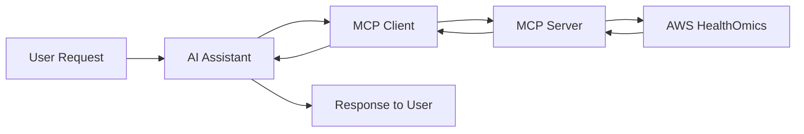

# Agentic Generative AI tutorial using MCP

This document explains how you can use Agentic AI tools connected to an MCP server to create workflows and interact with the [AWS HealthOmics](https://docs.aws.amazon.com/omics/latest/dev/what-is-healthomics.html) service using natural language prompts.

## What is MCP?

**Model Context Protocol (MCP)** is an open standard that enables AI assistants to securely connect to external data sources and tools. Think of it as a universal adapter that allows AI models to interact with various services, databases, and applications in a standardized way.

### Key Concepts

**MCP Server**: A service that exposes specific capabilities (tools, resources, prompts) to AI assistants. For example, an AWS HealthOmics MCP server provides tools to create workflows, start runs, and analyze results.

**MCP Client**: The AI assistant or application that connects to MCP servers to access their capabilities. Popular clients include Claude Desktop, Kiro IDE, and other AI development environments.

**Tools**: Functions that the AI can call to perform actions, like creating a workflow or querying a database.

**Resources**: Data sources that the AI can read from, such as files, databases, or API endpoints.

**Prompts**: Pre-defined prompt templates that can be dynamically populated with context.

### Why MCP Matters for Genomics

In the context of AWS HealthOmics and genomics workflows, MCP provides several key benefits:

1. **Natural Language Interface**: Instead of learning complex CLI commands or APIs, you can describe what you want to accomplish in plain English.

2. **Workflow Automation**: AI assistants can automatically create, configure, and execute complex genomics pipelines based on your requirements.

3. **Intelligent Troubleshooting**: When workflows fail, the AI can analyze logs, identify issues, and suggest solutions.

4. **Resource Optimization**: AI can analyze workflow performance and recommend optimizations for cost and runtime efficiency.

5. **Knowledge Integration**: The AI has access to both your specific data and general genomics best practices, providing contextual guidance.

### How It Works



When you ask an AI assistant to "create a GATK workflow for variant calling," the process flows like this:

1. **User Request**: You describe your genomics task in natural language
2. **AI Processing**: The assistant understands your intent and determines what actions are needed
3. **MCP Communication**: The assistant calls appropriate MCP tools (e.g., `CreateWorkflow`, `StartRun`)
4. **Service Execution**: The MCP server translates these calls into AWS HealthOmics API requests
5. **Result Processing**: The AI receives the results and presents them in a user-friendly format

### Example Use Cases

- **"Create a germline variant calling workflow using GATK best practices"**
- **"Start a run of the germline variant calling workflow with these FASTQ files"**
- **"Why did my last run fail and how can I fix it?"**
- **"Analyze the performance of my last 5 runs of workflow 123456 and suggest improvements"**
- **"Convert this WDL workflow to run on HealthOmics"**

## Getting Started

For this tutorial we will deploy Amazon Q Developer CLI (the MCP client) on an EC2 instance but you can equally install Q Developer CLI on your personal machine and you can use the HealthOmics MCP server with any Agentic AI tool that is capable of using MCP.

1. In the console or via the AWS CLI, start a t3.large Amazon EC2 instance using the latest Amazon Linux 2023 AMI.
2. In the console or via the AWS CLI, attach an IAM role with the minimum policy:
    ```
    {
        "Version": "2012-10-17",
        "Statement": [
            {
                "Effect": "Allow",
                "Action": [
                    "omics:ListWorkflows",
                    "omics:CreateWorkflow",
                    "omics:GetWorkflow",
                    "omics:CreateWorkflowVersion",
                    "omics:ListWorkflowVersions",
                    "omics:StartRun",
                    "omics:ListRuns",
                    "omics:GetRun",
                    "omics:ListRunTasks",
                    "omics:GetRunTask",
                    "logs:DescribeLogGroups",
                    "logs:DescribeLogStreams",
                    "logs:GetLogEvents",
                    "ssm:GetParametersByPath"
                ],
                "Resource": "*"
            },
            {
                "Effect": "Allow",
                "Action": [
                    "iam:PassRole"
                ],
                "Resource": "arn:aws:iam::*:role/HealthOmicsExecutionRole*"
            }
        ]
    }
    ```
    The above policy is very minimal and covers the permissions required by the MCP server. You will likely want to add additional permissions so that Q CLI can use additional tools to interact with other relevant resources like S3, IAM, and ECR.

3. Once the EC2 instance is running SSH into the machine.
4. The HealthOmics MCP server is most easily run using the uv Python package manager. Install this using:
    ```bash
    curl -LsSf https://astral.sh/uv/install.sh | sh
    ```
5. Install the most recent version of Python using `uv` and verify that the installed version is >= 3.10 using `uvx`:
    ```bash
    uv python install
    uvx python -V
    ```
6. Now install the Q Developer CLI tool:
    ```bash
    curl --proto '=https' --tlsv1.2 -sSf "https://desktop-release.q.us-east-1.amazonaws.com/latest/q-x86_64-linux.zip"\
        -o "q.zip"
    unzip q.zip
    ./q/install.sh
    ```

    Configure the installation with the following answers:

    ✔ Do you want q to modify your shell config (you will have to manually do this otherwise)? · Yes
    
    You will require either an AWS Developer ID or license. For the best experience a [Professional license](https://aws.amazon.com/q/developer/pricing/) is recommended however you may use a free license according to the restrictions of that tier.

    Complete the remaining answers depending on your developer ID or license as appropriate.

7. Configure the Q Developer CLI to add the HealthOmics MCP server":
    ```bash
    q mcp add --name aws-healthomics \
        --scope global \
        --command uvx \
        --args "awslabs.aws-healthomics-mcp-server"
    ```

8. Verify that the MCP server has been configured in the “global” scope:
    ```bash
    q mcp list
    ```

    You should see the following output:
    ```bash
    📄 workspace:
    /home/ec2-user/.amazonq/mcp.json
        (empty)

    🌍 global:
    /home/ec2-user/.aws/amazonq/mcp.json
        • aws-healthomics uvx
    ```

9. Launch Q CLI in “chat” mode":
    ```bash
    q chat
    ```

    The chat should open and indicate the MCP server has successfully loaded. On the first launch it may take up to 5 seconds to start the server as it pulls the required package from PyPi. Subsequent launches should complete much faster.

    ```bash
    ✓ aws_healthomics loaded in 3.87 s


       ⢠⣶⣶⣦⠀⠀⠀⠀⠀⠀⠀⠀⠀⠀⠀⠀⠀⠀⠀⠀⠀⠀⠀⠀⠀⠀⠀⠀⠀⠀⠀⠀⠀⠀⠀⠀⠀⠀⠀⠀⠀⠀⠀⠀⠀⠀⠀⠀⠀⠀⠀⠀⠀⠀⠀⠀⠀⠀⠀⠀⠀⠀⠀⠀⢀⣤⣶⣿⣿⣿⣶⣦⡀⠀
    ⠀⠀⠀⣾⡿⢻⣿⡆⠀⠀⠀⢀⣄⡄⢀⣠⣤⣤⡀⢀⣠⣤⣤⡀⠀⠀⢀⣠⣤⣤⣤⣄⠀⠀⢀⣤⣤⣤⣤⣤⣤⡀⠀⠀⣀⣤⣤⣤⣀⠀⠀⠀⢠⣤⡀⣀⣤⣤⣄⡀⠀⠀⠀⠀⠀⠀⢠⣿⣿⠋⠀⠀⠀⠙⣿⣿⡆
    ⠀⠀⣼⣿⠇⠀⣿⣿⡄⠀⠀⢸⣿⣿⠛⠉⠻⣿⣿⠛⠉⠛⣿⣿⠀⠀⠘⠛⠉⠉⠻⣿⣧⠀⠈⠛⠛⠛⣻⣿⡿⠀⢀⣾⣿⠛⠉⠻⣿⣷⡀⠀⢸⣿⡟⠛⠉⢻⣿⣷⠀⠀⠀⠀⠀⠀⣼⣿⡏⠀⠀⠀⠀⠀⢸⣿⣿
    ⠀⢰⣿⣿⣤⣤⣼⣿⣷⠀⠀⢸⣿⣿⠀⠀⠀⣿⣿⠀⠀⠀⣿⣿⠀⠀⢀⣴⣶⣶⣶⣿⣿⠀⠀⠀⣠⣾⡿⠋⠀⠀⢸⣿⣿⠀⠀⠀⣿⣿⡇⠀⢸⣿⡇⠀⠀⢸⣿⣿⠀⠀⠀⠀⠀⠀⢹⣿⣇⠀⠀⠀⠀⠀⢸⣿⡿
    ⢀⣿⣿⠋⠉⠉⠉⢻⣿⣇⠀⢸⣿⣿⠀⠀⠀⣿⣿⠀⠀⠀⣿⣿⠀⠀⣿⣿⡀⠀⣠⣿⣿⠀⢀⣴⣿⣋⣀⣀⣀⡀⠘⣿⣿⣄⣀⣠⣿⣿⠃⠀⢸⣿⡇⠀⠀⢸⣿⣿⠀⠀⠀⠀⠀⠀⠈⢿⣿⣦⣀⣀⣀⣴⣿⡿⠃
    ⠚⠛⠋⠀⠀⠀⠀⠘⠛⠛⠀⠘⠛⠛⠀⠀⠀⠛⠛⠀⠀⠀⠛⠛⠀⠀⠙⠻⠿⠟⠋⠛⠛⠀⠘⠛⠛⠛⠛⠛⠛⠃⠀⠈⠛⠿⠿⠿⠛⠁⠀⠀⠘⠛⠃⠀⠀⠘⠛⠛⠀⠀⠀⠀⠀⠀⠀⠀⠙⠛⠿⢿⣿⣿⣋⠀⠀
    ⠀⠀⠀⠀⠀⠀⠀⠀⠀⠀⠀⠀⠀⠀⠀⠀⠀⠀⠀⠀⠀⠀⠀⠀⠀⠀⠀⠀⠀⠀⠀⠀⠀⠀⠀⠀⠀⠀⠀⠀⠀⠀⠀⠀⠀⠀⠀⠀⠀⠀⠀⠀⠀⠀⠀⠀⠀⠀⠀⠀⠀⠀⠀⠀⠀⠀⠀⠀⠀⠀⠀⠀⠈⠛⠿⢿⡧

    ╭─────────────────────────────── Did you know? ────────────────────────────────╮
    │                                                                              │
    │     Get notified whenever Q CLI finishes responding. Just run q settings     │
    │                        chat.enableNotifications true                         │
    │                                                                              │
    ╰──────────────────────────────────────────────────────────────────────────────╯

    /help all commands  •  ctrl + j new lines  •  ctrl + s fuzzy search
    ━━━━━━━━━━━━━━━━━━━━━━━━━━━━━━━━━━━━━━━━━━━━━━━━━━━━━━━━━━━━━━━━━━━━━━━━━━━━━━━━
    🤖 You are chatting with claude-4-sonnet

    You can use the /tools command to list the tools that are available to Q CLI. The list will include some default tools but should also include those provided by the HealthOmics MCP server.

    /tools

    aws_healthomics (MCP):
    - aws_healthomics___AnalyzeAHORunPerformance    * not trusted
    - aws_healthomics___CreateAHOWorkflow           * not trusted
    - aws_healthomics___CreateAHOWorkflowVersion    * not trusted
    - aws_healthomics___DiagnoseAHORunFailure       * not trusted
    - aws_healthomics___GetAHORun                   * not trusted
    - aws_healthomics___GetAHORunEngineLogs         * not trusted
    - aws_healthomics___GetAHORunLogs               * not trusted
    - aws_healthomics___GetAHORunManifestLogs       * not trusted
    - aws_healthomics___GetAHORunTask               * not trusted
    - aws_healthomics___GetAHOSupportedRegions      * not trusted
    - aws_healthomics___GetAHOTaskLogs              * not trusted
    - aws_healthomics___GetAHOWorkflow              * not trusted
    - aws_healthomics___ListAHORunTasks             * not trusted
    - aws_healthomics___ListAHORuns                 * not trusted
    - aws_healthomics___ListAHOWorkflowVersions     * not trusted
    - aws_healthomics___ListAHOWorkflows            * not trusted
    - aws_healthomics___PackageAHOWorkflow          * not trusted
    - aws_healthomics___StartAHORun                 * not trusted
    ```

When Q CLI is first launched the tools provided by the HealthOmics MCP server are not automatically trusted. This means that Q will need to ask your permission to use a tool each time it attempts to use it. As you gain confidence with the tools you might choose to trust some actions such as the Get* , List* , AnalyzeAHORunPerformance , and DiagnoseAHORunFailure tools as they don’t modify resources in HealthOmics. You should only trust other resources if you are comfortable with Q autonomously performing actions like creating workflows in your account and starting workflow runs. Remember that generative AI tools can make mistakes so it is best to verify what actions they are taking.

In addition to the tools listed about, Q CLI also has access to bash command and AWS CLI commands which have appropriate preconfigured trust levels (which you can modify if needed).

At this point you can chat with the CLI, based on your prompts and the context of your chat, it will decide when it is appropriate to use any of it’s available tools and call them with appropriate parameters. The MCP server will provide the agent with the relevant information about your HealthOmics workflows, runs, logs etc which will inform the response generated by the agent. For example, you could ask it to list your most recent run failure.

The following is the result of a real interaction with Q CLI using the HealthOmics MCP server.

```
> What was my last workflow run that failed?

> I'll help you find your last failed workflow run. Let me check your recent HealthOmics workflow runs and filter for failed ones.


🛠️  Using tool: ListAHORuns from mcp server aws_healthomics
 ⋮
 ● Running ListAHORuns with the param:
 ⋮  {
 ⋮    "arguments": {
 ⋮      "max_results": 20,
 ⋮      "status": "FAILED"
 ⋮    },
 ⋮    "name": "ListAHORuns"

Allow this action? Use 't' to trust (always allow) this tool for the session. [y/n/t]:

Q has determined that the best way to answer the question is to call the ListAHORuns tool where the run status is FAILED. You may agree to this by pressing y or reject it with n . If you reject a request Q will usually suggest something else or perhaps conclude that it cannot answer with the information available. If you want to trust the ListAHORuns tool for the remainder of the chat session you can press t. This will run the tool and will not prompt you again when invoking the same tool in this session.

Q summarizes the information it gets from the MCP server and produces a response.

> Your most recent failed workflow run is:

Run ID: 4525293
Name: minimal-test-run
Status: FAILED
Workflow ID: 6717365
Created: July 1, 2025 at 4:31 PM UTC
Started: July 1, 2025 at 4:34 PM UTC
Stopped: July 1, 2025 at 4:54 PM UTC
Duration: ~19 minutes

This run failed yesterday. Would you like me to help diagnose what went wrong with this run? I can retrieve detailed logs and failure information to help you understand the cause of the failure.
```

I replied with the prompt “what caused the error”?, based on the current context Q determines that best tool to use is DiagnoseAHORunFailure and that the most appropriate run ID to use is 4525293 because it just identified that as a failed run. Because the tool doesn’t require modification to any of my HealthOmics resources I am comfortable trusting it for the rest of the session.

```

> what caused the error?

> I'll diagnose what caused the error in your failed run (4525293). Let me retrieve comprehensive diagnostic information including logs and failure details.


🛠️  Using tool: DiagnoseAHORunFailure from mcp server aws_healthomics
 ⋮
 ● Running DiagnoseAHORunFailure with the param:
 ⋮  {
 ⋮    "arguments": {
 ⋮      "run_id": "4525293"
 ⋮    },
 ⋮    "name": "DiagnoseAHORunFailure"

Allow this action? Use 't' to trust (always allow) this tool for the session. [y/n/t]:

> t

 ⋮  }
 ⋮
 ● Completed in 0.867s


> The error in your workflow run was caused by an ECR permission issue. Here's what happened:

## Root Cause
ECR_PERMISSION_ERROR - The workflow failed because it couldn't access a Docker container image stored in Amazon ECR (Elastic Container Registry).

## Specific Error Details
• **Failed Image:** 123456789012.dkr.ecr.us-east-1.amazonaws.com/sorter:1.4.2
• **Task that Failed:** Demux task in the sorting step
• **Error Message:** "ECR access denied (omics.amazonaws.com)"

## What Went Wrong
The workflow was trying to use a container image from your private ECR repository, but the HealthOmics service doesn't have permission to pull that image. The error occurred when the Demux task tried to start, about 19 minutes into the run.

## How to Fix This
You need to grant the HealthOmics service permission to access your ECR repository. Here are the steps:

1. Add ECR Resource Policy - Attach a resource-based policy to your ECR repository that allows the HealthOmics service to pull images:

json
{
  "Version": "2012-10-17",
  "Statement": [
    {
      "Sid": "AllowHealthOmicsAccess",
      "Effect": "Allow",
      "Principal": {
        "Service": "omics.amazonaws.com"
      },
      "Action": [
        "ecr:GetDownloadUrlForLayer",
        "ecr:BatchGetImage",
        "ecr:BatchCheckLayerAvailability"
      ]
    }
  ]
}

...other suggestions ...


Would you like me to help you set up these permissions, or do you need assistance with any other aspect of fixing this workflow?

Q has identified that the issue lies with incorrect ECR permissions for a container image used in my workflow and suggest what the ECR resource policy should be. It also suggest checking some other conditions like the workflow role which I have removed to save space. Suggestions are generally ordered by what Q determines is the most likely fix and it may also suggest other possible causes or things to check.
```

From here you can continue the chat. For example, you could ask it to “Fix my ECR resource policy and then re-run the workflow”. When the run succeeds you could ask it to “Analyze the last run and suggest where my resources might be over or under utilized”.

To exit Q CLI at any time you can type `/quit`.

If Q is performing an action (or thinking) and you want to interrupt it you can press `CTRL+C` at any time.

## Example Starter Prompts

The following are some examples of prompts you can use. Many more are possible.

### Account Management:

- _"What was my last successful run?"_
- _"What workflow did run 12345 use?"_
- _"Download the results of run 12345"_

### Workflow Development:

- _"Help me create a new genomic variant calling workflow"_

### Production Execution:

- _"Run my alignment workflow on these FASTQ files"_

### Troubleshooting:

- _"My workflow run 123456 failed, what went wrong?"_

### Performance Optimization:

- _"How can I make my last workflow run faster?"_
- _"Analyze the last five successful runs of workflow 124678 and suggest optimizations"_

### Iterative Development:

- _"Download the workflow definition and apply the changes you suggested, then create a new workflow version"_

### Migration:

- _"This directory contains the definition of a Nextflow workflow, help me migrate it to run in HealthOmics"_


